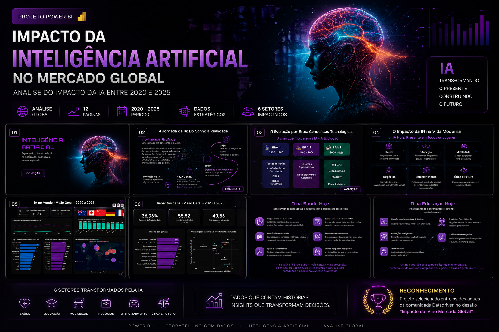
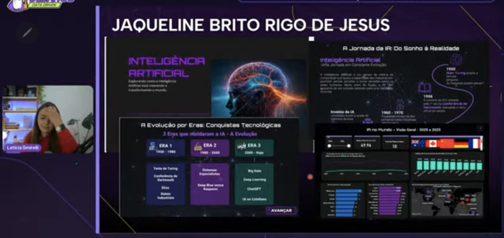

# 🤖 Impacto da Inteligência Artificial no Mercado Global

## 🏆 Reconhecimento

Este projeto foi selecionado entre os destaques da comunidade Datadriven no desafio **"Impacto da IA no Mercado Global"**.

🏆 Projeto selecionado entre os destaques da comunidade Datadriven no desafio "Impacto da IA no Mercado Global".

Projeto desenvolvido em Power BI com o objetivo de analisar como a Inteligência Artificial impactou diferentes setores da sociedade e da economia mundial entre 2020 e 2025.

---

## 🚀 Dashboard Interativo

O dashboard completo pode ser acessado através do link abaixo:

➡️ https://app.powerbi.com/view?r=eyJrIjoiYmU4NjZiMGMtZTAwZC00ODc1LWJjZmYtMGE3MzExMDFiMmYzIiwidCI6ImQ3NzNiNzQxLWE4ODYtNDQxNi1hYmUwLTVjNzIzYTc5MmIzMiJ9

---

## 🛠 Ferramentas Utilizadas

- Power BI
- Power Query
- Excel
- Figma
- Storytelling com Dados
- Inteligência Artificial

---

## 🎯 Objetivo do Projeto

Analisar o impacto da Inteligência Artificial no mercado global entre 2020 e 2025, explorando sua evolução histórica, adoção em diferentes setores e os reflexos na sociedade, economia e mercado de trabalho.

---

## 📖 Estrutura do Dashboard

### 1. Introdução à Inteligência Artificial
Apresentação do tema e contexto geral do projeto.

### 2. Jornada da IA: Do Sonho à Realidade
Linha do tempo mostrando a evolução histórica da Inteligência Artificial.

### 3. Evolução por Eras
Principais marcos tecnológicos que moldaram a IA ao longo das décadas.

### 4. Impacto da IA na Vida Moderna
Visão geral dos setores impactados pela Inteligência Artificial.

### 5. Panorama Global da IA
Indicadores e métricas globais entre 2020 e 2025.

### 6. Análise Global de Impacto
Comparativo entre investimentos, adoção e transformação digital.

### 7. IA na Saúde
Transformação dos diagnósticos, tratamentos e cuidados médicos.

### 8. IA na Educação
Personalização do ensino e evolução das metodologias educacionais.

### 9. IA na Mobilidade
Impactos em transporte inteligente e veículos autônomos.

### 10. IA nos Negócios
Automação, produtividade e tomada de decisão baseada em dados.

### 11. IA no Entretenimento
Mudanças na criação e consumo de conteúdo digital.

### 12. IA na Ética e Futuro
Desafios, riscos e oportunidades da Inteligência Artificial.

---
